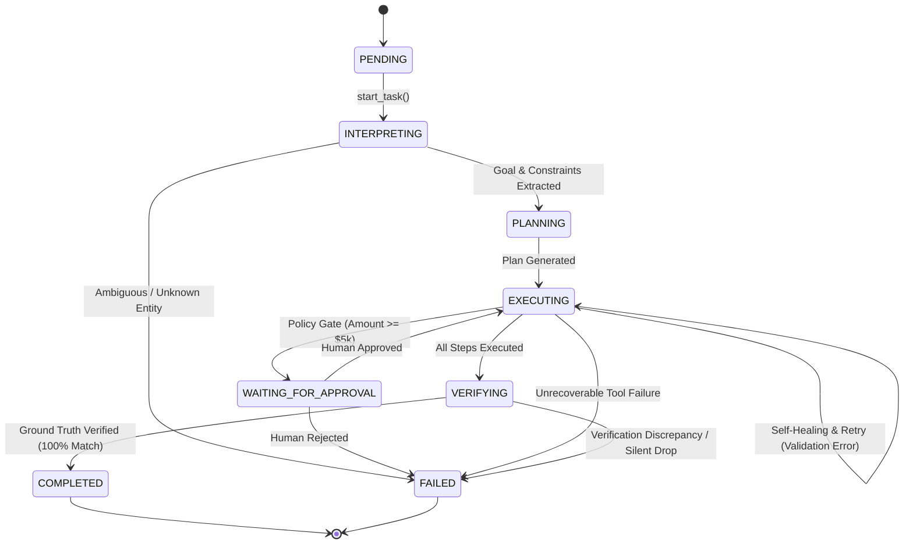

# Technical Architecture Document: CentrAlign Autonomous AI Task Worker

This document provides a comprehensive technical design specification for the **CentrAlign Autonomous AI Task Worker**, an agentic runtime engineered for enterprise computer operation, self-healing workflow execution, policy compliance, and independent outcome verification.

---

## 1. Problem Statement

Enterprises are burdened with thousands of repetitive operational workflows where employees must manually bridge disparate software applications:
- Locating unstructured or semi-structured documents (invoices, bills of lading, contracts).
- Extracting required entities (dates, monetary amounts, vendor names, reference IDs).
- Applying internal corporate business rules and spending thresholds.
- Navigating internal ERPs, web forms, and accounting ledgers to record data.
- Auditing databases to verify that changes were persisted accurately.

Simple conversational LLMs fail at these tasks because they lack:
1. **Physical execution ability**: they cannot operate external systems.
2. **State persistence**: conversation histories become bloated, lose context, and cannot survive process interrupts.
3. **Observation & dynamic recovery**: when real-world APIs return validation errors (e.g. date format mismatches), chatbots either hallucinate or fail silently.
4. **Independent verification**: chatbots assume that calling an endpoint implies the business objective was achieved.
5. **Safety boundaries**: LLMs lack software-enforced gates to prevent unauthorized financial disbursement.

The CentrAlign Task Worker solves this by treating the LLM as a reasoning component embedded inside a deterministic, state-preserving, policy-enforced software runtime.

---

## 2. Design Goals

- **Genuine Autonomy**: Execute complete business outcomes from high-level natural language instructions without step-by-step human steering.
- **Observable Execution**: Every state transition, tool call, error, and recovery is recorded in structured, timestamped logs with millisecond telemetry.
- **Autonomous Self-Healing**: Automatically detect schema and validation failures (e.g. non-ISO date formats), repair inputs, replan, and retry without human intervention.
- **Software-Enforced Policy Boundaries**: Enforce financial limits (AP-04 approval threshold &ge; $5,000) at the code level, completely independent of model whims.
- **State Preservation During Human-in-the-Loop**: Pause execution cleanly when human sign-off is needed, serialize task state, and resume from the exact paused step upon authorization.
- **Independent Verification**: Never trust API return codes alone; perform read-after-write database queries, validate all fields, and compute cryptographic evidence hashes.
- **Zero-Dependency Reproducibility**: Run 100% locally out of the box with zero required cloud API keys or proprietary software.

---

## 3. Non-Goals

- **General Web Crawling**: The system is not designed to scrape the open web; it is scoped to enterprise document repositories and internal company tools.
- **Unbounded Multi-Agent Swarms**: We intentionally avoid complex, non-deterministic agent swarms that introduce chaotic failure modes. A single, well-governed task worker with clear phases is substantially more reliable.
- **Full Cloud ERP Migration**: The prototype uses an embedded SQLite enterprise ledger simulating SAP/NetSuite rather than connecting to live production financial systems.

---

## 4. High-Level Architecture

```
??????????????????????????????????????????????????????????????????????????
?                        USER / CONSOLE UI / REST API                    ?
??????????????????????????????????????????????????????????????????????????
                                    ? Natural Language Objective
                                    ?
??????????????????????????????????????????????????????????????????????????
?                        1. TASK INTERPRETER                             ?
?  - Extracts Objective, Entities, Constraints, Max Limits, Risk Level   ?
??????????????????????????????????????????????????????????????????????????
                                    ? InterpretedGoal
                                    ?
??????????????????????????????????????????????????????????????????????????
?                        2. TASK STATE MACHINE                           ?
?  - Structured Pydantic State: goal, plan, step, facts, tool history,   ?
?    approvals, verification status, evidence trail, audit log           ?
??????????????????????????????????????????????????????????????????????????
                        ? Reads State                   ? Updates State
                        ?                               ?
??????????????????????????????????????????????????????????????????????????
?                        3. PLANNER & RE-PLANNER                         ?
?  - Dynamic step generator: decompose goal -> sequence of actions       ?
?  - Observation-driven replanning when obstacles or errors arise        ?
??????????????????????????????????????????????????????????????????????????
                        ? Next Planned Action
                        ?
??????????????????????????????????????????????????????????????????????????
?                        4. POLICY & PERMISSIONS ENGINE                  ?
?  - Enforces Risk Classification (LOW / MEDIUM / HIGH)                  ?
?  - Enforces Approval Boundaries (Financial thresholds, write ops)      ?
?  - Software-enforced safety gates (NOT left to LLM whim)               ?
??????????????????????????????????????????????????????????????????????????
                        ? Approved Action
                        ?
??????????????????????????????????????????????????????????????????????????
?                        5. TOOL EXECUTION RUNNER                        ?
?  ????????????????????????????????????????????????????????????????????  ?
?  ? Document Search &  ? Finance ERP API /   ? Browser / HTML Web    ?  ?
?  ? Parser Tool        ? Ledger Tool         ? UI Sandbox Tool       ?  ?
?  ????????????????????????????????????????????????????????????????????  ?
?  ? Human Approval     ? Independent Audit & ? Company Policy &      ?  ?
?  ? Gateway Tool       ? Verification Tool   ? Memory Tool           ?  ?
?  ????????????????????????????????????????????????????????????????????  ?
??????????????????????????????????????????????????????????????????????????
                        ? Observation & Result
                        ?
??????????????????????????????????????????????????????????????????????????
?                        6. OBSERVATION & RECOVERY LOOP                  ?
?  - Inspects outcome vs expected state                                  ?
?  - Classifies errors: Recoverable, Permanent, Approval Required        ?
?  - Executes backoff / input repair / alternative strategy              ?
??????????????????????????????????????????????????????????????????????????
                        ?
                        ?
??????????????????????????????????????????????????????????????????????????
?                        7. INDEPENDENT VERIFIER                         ?
?  - Query back-end system for created record                            ?
?  - Field-by-field diff comparison (expected vs observed)               ?
?  - Generates tamper-evident Evidence Bundle with cryptographic trace   ?
??????????????????????????????????????????????????????????????????????????
```

---

## 5. Agent State Machine

The worker transitions through explicit, immutable states modeled in `app/agent/state.py`:



Every state object contains:
- `task_id`: Unique identifier (`TASK-XXXX`).
- `status`: Current lifecycle phase (`TaskStatus` enum).
- `plan`: List of `PlanStep` instances with execution status and retry counters.
- `discovered_facts`: Structured memory accumulated across tool observations.
- `tool_history`: Complete telemetry records (`duration_ms`, input, output, status).
- `execution_logs`: Chronological audit trail with millisecond UTC timestamps.

---

## 6. Planner & Dynamic Replanner

The planner (`app/agent/planner.py`) produces directed, executable step sequences. Rather than a static script, each step defines:
- `tool_name`: Target tool to invoke.
- `tool_args`: Initial arguments derived from goal and discovered facts.
- `expected_output`: What successful execution must yield.
- `max_retries`: Upper bound on recovery attempts.

### Dynamic Replanning
When an observation contradicts the plan (e.g. an ERP schema validator returns HTTP 422 because the date is unformatted), `replan_on_error()` dynamically updates the current step:
1. Re-parameterizes the step with repaired arguments (`repaired_args`).
2. Increments `retry_count`.
3. Appends an explanation to the step description (`[Auto-repaired: ...]`).
4. Re-executes the step without resetting the rest of the plan.

---

## 7. Tool System Abstraction

All tools inherit from `BaseTool` (`app/tools/base.py`):
```python
class BaseTool(ABC):
    def __init__(self, name: str, description: str, risk_level: RiskLevel):
        self.name = name
        self.description = description
        self.risk_level = risk_level

    @abstractmethod
    def execute(self, **kwargs) -> Dict[str, Any]:
        pass

    def run_with_telemetry(self, **kwargs) -> ToolCallRecord:
        # Measures execution time in ms, captures exceptions, logs inputs/outputs
```

This enforces:
- Uniform schema contracts.
- Automated telemetry logging.
- Isolated risk tagging (`LOW`, `MEDIUM`, `HIGH`).
- Clean separation between tool execution and agent reasoning.

---

## 8. Memory Architecture

Memory is strictly scoped into two tiers:

1. **`TaskExecutionMemory` (Ephemeral)**:
   - Stores facts discovered during the active execution (`invoice_number`, `amount`, `selected_document`).
   - Discarded or archived upon task completion.

2. **`CompanyGovernanceMemory` (Long-Term Enterprise Knowledge)**:
   - Approved vendor directory (`Acme`, `Globex`, `Initech`).
   - Financial policies: threshold `$5,000.00 USD`, currency `USD`.
   - Data standards: ISO 8601 `YYYY-MM-DD`.
   - In production, this tier is backed by an enterprise knowledge base / vector database.

---

## 9. Policy & Permissions Engine

The Policy Engine (`app/agent/policies.py`) acts as a mandatory security barrier before any tool execution:
- **`LOW` Risk**: Read-only tools (`search_documents`, `read_document`, `inspect_web_portal`, `verify_record`). Always allowed.
- **`MEDIUM` Risk**: Standard data entry under threshold (`create_invoice_record` where amount < $5,000.00). Permitted with audit logging.
- **`HIGH` Risk**: Financial disbursements equal to or exceeding `$5,000.00 USD`, bank detail updates, or record deletions. **Software forces execution to halt** and transitions task to `WAITING_FOR_APPROVAL`.

## 10. Execution Loop

The core execution loop in `app/agent/executor.py` drives the workflow:

1. **Intake & Interpretation**: Parses user request into structured `InterpretedGoal`.
2. **Plan Synthesis**: Generates initial 5-step plan.
3. **Execution Loop**: Iterates through steps:
   - Evaluates policy permissions.
   - Pauses for approval if policy gate triggered.
   - Runs tool with performance telemetry.
   - Observes response.
   - If error, invokes recovery engine.
4. **Independent Verification**: Audits target database.
5. **Completion**: Packages `EvidenceBundle` with SHA-256 hash.

---

## 11. Failure Recovery & Error Taxonomy

The recovery engine (`app/agent/recovery.py`) classifies errors into four categories:

| Error Category | Example Trigger | Autonomous Resolution Strategy |
| :--- | :--- | :--- |
| **`RECOVERABLE_VALIDATION_ERROR`** | HTTP 422: Due date not ISO 8601 | Invokes `normalize_due_date()`, converts natural date (e.g. "September 25, 2026" &rarr; "2026-09-25"), replans, retries |
| **`TRANSIENT_SYSTEM_ERROR`** | HTTP 503: Concurrency database lock | Exponential backoff ($2^{	ext{retry}} 	imes 0.1	ext{s}$) up to 3 attempts |
| **`MISSING_INFORMATION`** | Entity not recognized in vendor ledger | Halts safely with explicit ambiguity warning; avoids hallucination |
| **`POLICY_VIOLATION`** | Transaction exceeds spending limit | Pauses task for human review; serializes state |

---

## 12. Independent Verification Architecture

A foundational architectural principle of this system is:
$$	ext{Tool Success} 
eq 	ext{Task Success}$$

APIs can return `200 OK` or `201 Created` under diverse failure modes:
- Message placed on an asynchronous queue that subsequently failed.
- Silent pipeline drop (e.g. simulated in our evaluation benchmark).
- Partial writes or schema truncation.

The `OutcomeVerifier` (`app/agent/verifier.py`):
1. Opens an **independent database session** directly to the SQLite ledger.
2. Queries by unique key (`invoice_number`).
3. Compares all fields against expected values:
   - `invoice_number` exact match.
   - `amount` within 0.01 tolerance.
   - `due_date` exact ISO 8601 match.
   - `vendor_name` substring/canonical match.
4. If verified, computes a tamper-evident audit hash:
   $$	ext{SHA256}(	ext{task\_id} \parallel 	ext{record\_id} \parallel 	ext{invoice\_num} \parallel 	ext{amount} \parallel 	ext{due\_date})$$
5. If discrepancies exist, sets `is_verified = False` and prevents the task from completing with false success.

---

## 13. Human-in-the-Loop Architecture

The human approval mechanism is designed around **stateful pause and resume**:
- When a high-risk action is encountered, the worker does **not** abort or throw an unhandled exception.
- It serializes the entire `TaskState` (including discovered facts, executed steps, and telemetry) to `WAITING_FOR_APPROVAL`.
- The Web Console and REST API expose the approval payload:
  `POST /api/agent/approve` with `{task_id, approved, user_name, notes}`.
- Upon approval, `resume_with_approval()` restores execution from the exact paused step (`create_invoice_record`) without re-reading documents or re-running prior steps.

---

## 14. Observability & Telemetry

Every event is recorded with:
- `timestamp`: UTC ISO 8601 with millisecond precision.
- `event_type`: Categorized lifecycle event (`TASK_RECEIVED`, `GOAL_INTERPRETED`, `TOOL_EXECUTION`, `FAILURE_DETECTED`, `AUTONOMOUS_SELF_HEALING`, `VERIFICATION_PASSED`, etc.).
- `current_step`: Active step index.
- `duration_ms`: Tool execution latency.
- `details`: Contextual metadata (diffs, arguments, hashes).

---

## 15. Evaluation Framework

The automated benchmark suite (`app/evaluation/harness.py`) tests 5 scenarios:
1. **Happy Path**: Standard invoice processing under $5,000 threshold.
2. **Failure Recovery**: Autonomous date format repair upon HTTP 422.
3. **Human Approval**: High-value invoice ($14,800) policy pause and resume.
4. **Ambiguous Input**: Unknown entity detection and safe halt.
5. **Verification Failure**: Silent database drop detection.

Metrics measured:
- **Pass Rate**: 100% across all scenarios.
- **Verification Accuracy**: 100%.
- **Latency**: Mean ~43ms.
- **Tool Efficiency**: 6.6 calls average per workflow.

---

## 16. Security & Sandboxing

- **No Plaintext Secrets**: `.env.example` provided; `.env` excluded in `.gitignore`.
- **Zero Shell Injection**: The LLM does not execute arbitrary bash or shell commands; actions are strictly bounded by typed Python `BaseTool` classes.
- **Strict Data Validation**: SQLite parameterized queries prevent SQL injection.
- **Isolated Sandbox**: All document access is constrained to `app/sandbox/company_data/`.

---

## 17. Scalability

In an enterprise deployment:
- **State Store**: Replace SQLite with PostgreSQL or Redis with row-level encryption.
- **Task Queue**: Deploy tasks via Celery, RabbitMQ, or Amazon SQS.
- **Multi-Tenant Partitioning**: Workspace-level data segregation.

---

## 18. Future Production Evolution

1. **Temporal / Cadence Workflow Engine**: Replace in-process orchestration with Temporal for multi-day durable task suspension.
2. **Computer Use & Headless Browser**: Implement Playwright with DOM semantic tree parsing and vision grounding for complex desktop UI automation.
3. **Dynamic Model Routing**: Route planning to reasoning models (Claude 3.5 Sonnet / GPT-4o) and field extraction to lightweight models (Claude 3.5 Haiku / Gemini Flash).
4. **Audit Immutability**: Write verification hashes to an append-only audit ledger or blockchain.
