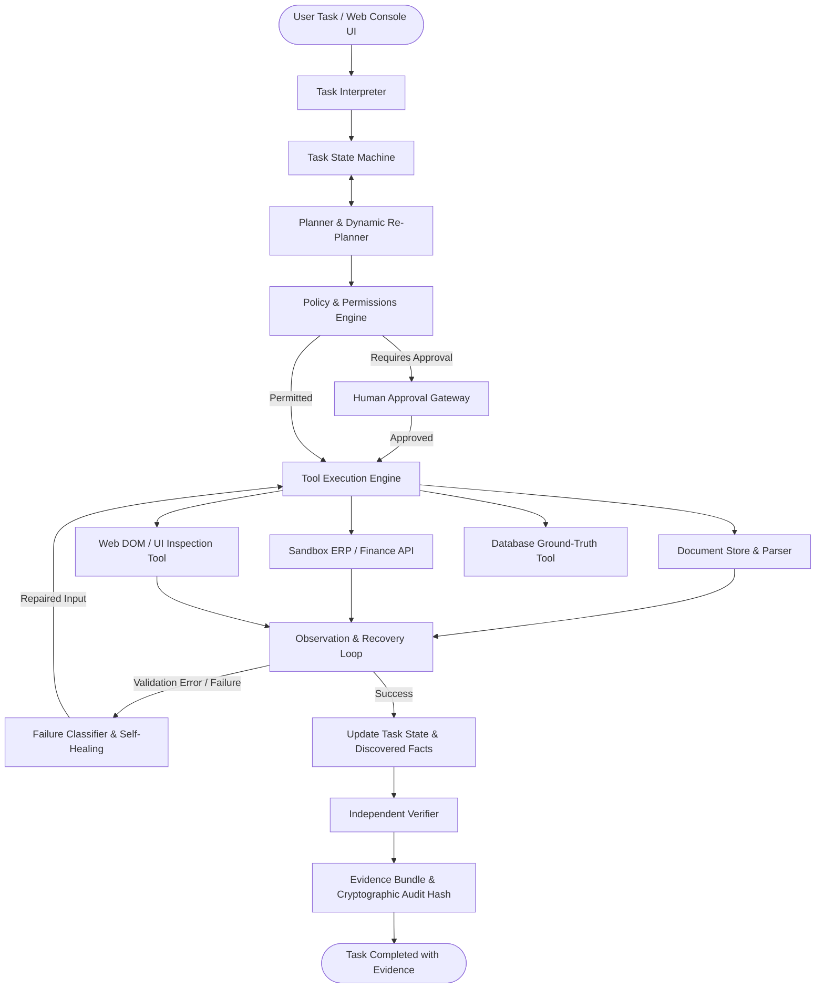

# CentrAlign Autonomous AI Task Worker

> **A genuinely autonomous, self-healing, verifiable enterprise AI task worker that turns natural language business objectives into audited, policy-compliant computer actions.**

Built as a submission for the **CentrAlign AI ? AI Engineering Intern hiring challenge**.

---

## 1. Why I Built This

At CentrAlign AI, the mission is to create true enterprise **AI employees** rather than superficial chatbot assistants. Real enterprise work does not consist of generating text; it requires:
1. **Understanding business objectives** rather than requiring every sub-action to be micromanaged.
2. **Interacting with messy internal systems**: unstructured document repositories, semi-structured files, internal ERPs, and web portals.
3. **Observing real-world feedback**: inspecting tool output, detecting schema and validation errors, and **adapting dynamically**.
4. **Enforcing strict governance**: respecting corporate spending thresholds, pausing for human sign-off on sensitive operations, and preserving execution state.
5. **Verifying outcomes**: never trusting `status == 200` alone, but independently auditing ground-truth databases and producing cryptographic evidence trails.

This prototype demonstrates a complete, narrow, production-grade slice of that runtime: **Autonomous Invoice Processing, Financial Ledger Commit, and Outcome Verification**.

---

## 2. Quickstart: How to Run Locally

The system has **zero proprietary external dependencies** and includes a built-in deterministic autonomous reasoner that runs 100% reliably out of the box with **zero API keys needed**, while seamlessly accepting live OpenAI, Anthropic, or Gemini keys if configured.

### Prerequisites
- Python 3.10+
- Installed packages: `fastapi`, `uvicorn`, `pydantic`, `httpx`, `pytest`

### Step 1: Clone & Install
```bash
pip install -r requirements.txt
```

### Step 2: Launch Web Agent Console & ERP Sandbox
```bash
python main.py
```
Open your browser to: **`http://localhost:8000`**

### Step 3: Run the Automated Benchmark Suite
```bash
python -m app.evaluation.harness
```

### Step 4: Run the Full Test Suite
```bash
python -m pytest tests/ -v
```

---

## 3. Architecture & System Design



The system is strictly decomposed into:
- **`app/agent/state.py`**: Explicit, fully-serializable, observable state (`TaskState`, `PlanStep`, `DiscoveredFacts`, `ToolCallRecord`, `ApprovalRequest`, `VerificationResult`, `EvidenceBundle`).
- **`app/agent/interpreter.py`**: Goal extraction, entity recognition, constraint parsing, risk scoring, and ambiguity detection.
- **`app/agent/planner.py`**: Action decomposition and reactive replanning when observations contradict prior assumptions.
- **`app/agent/policies.py`**: Software-enforced safety policies (AP-04 threshold gate for amounts &ge; $5,000.00).
- **`app/agent/recovery.py`**: Error classification, exponential backoff, and autonomous self-healing (e.g. ISO 8601 date normalizer).
- **`app/agent/verifier.py`**: Independent read-after-write database auditor with SHA-256 evidence hashing.
- **`app/agent/memory.py`**: Scoped memory architecture (`TaskExecutionMemory` vs `CompanyGovernanceMemory`).
- **`app/agent/executor.py`**: Core autonomous loop orchestrator with pause-and-resume state preservation.
- **`app/tools/`**: Clean `BaseTool` abstractions with risk levels and performance telemetry.
- **`app/sandbox/`**: Enterprise sandbox with SQLite ERP ledger (`sandbox_erp.db`), REST API, HTML portal, and document repository.

---

## 4. The Core Agent Loop

The worker operates on a 7-stage reactive control cycle:

$$	ext{Goal} \longrightarrow 	ext{Understand} \longrightarrow 	ext{Plan} \longrightarrow 	ext{Execute} \longrightarrow 	ext{Observe} \longrightarrow 	ext{Adapt} \longrightarrow 	ext{Verify} \longrightarrow 	ext{Complete}$$

1. **Understand**: Natural language prompt is parsed into structured intent, identifying vendor entities, requested fields, amount constraints, and ambiguities.
2. **Plan**: Decomposes the goal into discrete verifiable steps with expected outputs.
3. **Tool Selection & Policy Check**: Evaluates action risk (`LOW`, `MEDIUM`, `HIGH`). If an action breaches policy (e.g. amount &ge; $5,000), pauses execution for human authorization.
4. **Execute**: Invokes tools with telemetry tracking (duration in ms, arguments, and return status).
5. **Observe**: Captures responses, distinguishes between expected states and schema/system errors.
6. **Adapt & Self-Heal**: Upon catching recoverable errors (such as non-ISO date formats), the agent normalizes inputs, replans the step, and retries.
7. **Verify & Prove**: Independently audits the database, compares all fields, computes an audit trace hash, and compiles an `EvidenceBundle`.

---

## 5. Built-in Tools

| Tool Name | Risk Level | Description | Failure Behavior |
| :--- | :---: | :--- | :--- |
| `search_documents` | `LOW` | Scans corporate repository (`app/sandbox/company_data/invoices/`) | Returns empty list if no matches |
| `read_document` | `LOW` | Extracts text and header fields (Invoice #, Date, Due Date, Amount) | Raises `FileNotFoundError` if path invalid |
| `create_invoice_record` | `MEDIUM` / `HIGH` | Commits verified invoice into ERP SQLite ledger | Raises HTTP 422 on invalid schema; HTTP 503 on lock |
| `inspect_web_portal` | `LOW` | Simulates browser navigation across `/sandbox/portal` DOM | Checks record visibility in live HTML table |
| `verify_record` | `LOW` | Directly queries SQLite database for read-after-write audit | Fails verification if fields mismatch or record missing |

---

## 6. Failure Recovery & Self-Healing

The agent implements an explicit error taxonomy:

1. **`RECOVERABLE_VALIDATION_ERROR`**: E.g. Document specifies due date as `"September 25, 2026"` or `"09/25/2026"`. The ERP schema validator rejects the payload with HTTP 422. The agent observes the error, calls `normalize_due_date()`, converts the date to ISO 8601 `"2026-09-25"`, marks the step as `RECOVERED`, and successfully posts the invoice.
2. **`TRANSIENT_SYSTEM_ERROR`**: Temporary database locks or HTTP 503 errors trigger exponential backoff with jitter up to 3 retries.
3. **`MISSING_INFORMATION`**: If an entity is unrecognized (e.g. `"Wayne Enterprises"`), the agent halts safely with an ambiguity warning rather than hallucinating fake data.
4. **`POLICY_VIOLATION`**: If an action exceeds financial governance limits, execution is paused for human authorization.

---

## 7. Safe Human-in-the-Loop Controls

Under corporate policy **AP-04**:
- Transactions **under $5,000.00 USD** are executed autonomously with full audit logging.
- Transactions **equal to or exceeding $5,000.00 USD** trigger a mandatory policy pause.
- When paused (`WAITING_FOR_APPROVAL`):
  1. The complete task state is serialized and preserved.
  2. The Web Console displays an interactive **Human Approval Gateway** card with the exact amount, reason, and notes input.
  3. Clicking `[Approve]` or `[Reject]` calls `/api/agent/approve`, resuming execution from the exact paused step without restarting!

---

## 8. Independent Verification & Evidence Trail

The agent **never assumes `tool_success == task_success`**.
Even when the ERP API returns `201 Created`, the worker:
1. Queries the SQLite ledger directly using an independent database connection.
2. Validates field-by-field equality:
   - `invoice_number == expected_invoice_number`
   - `abs(amount - expected_amount) < 0.01`
   - `due_date == expected_due_date`
   - `vendor_name in db_vendor`
3. Generates a cryptographic SHA-256 evidence hash:
   $$	ext{Hash} = 	ext{SHA256}(	ext{task\_id} \parallel 	ext{record\_id} \parallel 	ext{invoice\_num} \parallel 	ext{amount} \parallel 	ext{due\_date})$$
4. Compiles a tamper-evident `EvidenceBundle` stored in `TaskState`.

---

## 9. Evaluation Results

The evaluation harness evaluates 5 canonical enterprise scenarios:

| Scenario | Objective | Tools Called | Retries | Verified | Status |
| :--- | :--- | :---: | :---: | :---: | :---: |
| **1. Happy Path** | Autonomous invoice extraction (< $5k) | 8 calls | 0 | Yes | **PASSED** |
| **2. Self-Healing** | Date format schema failure & auto-recovery | 9 calls | 1 | Yes | **PASSED** |
| **3. Human Approval** | High-value invoice ($14,800) policy pause & resume | 8 calls | 0 | Yes | **PASSED** |
| **4. Ambiguity Catch** | Non-existent vendor safe halting | 0 calls | 0 | N/A | **PASSED** |
| **5. Verification Catch**| Simulated silent pipeline drop detection | 8 calls | 0 | Caught | **PASSED** |

**Benchmark Score:** 5 / 5 (100.0% Pass Rate) | Mean Latency: ~43ms | Verification Accuracy: 100%.

---

## 10. Repository Structure

```
??? app/
?   ??? agent/
?   ?   ??? state.py           # Pydantic TaskState, PlanStep, EvidenceBundle
?   ?   ??? interpreter.py     # Natural language goal & entity parser
?   ?   ??? planner.py         # Dynamic action decomposition & replanning
?   ?   ??? policies.py        # Software-enforced risk & approval policy engine
?   ?   ??? recovery.py        # Self-healing, date normalization & retry backoff
?   ?   ??? verifier.py        # Independent database read-after-write verifier
?   ?   ??? memory.py          # TaskMemory and CompanyGovernanceMemory
?   ?   ??? llm_provider.py    # Autonomous hybrid reasoning provider
?   ?   ??? executor.py        # Core autonomous task loop orchestrator
?   ??? tools/
?   ?   ??? base.py            # BaseTool abstract class with telemetry
?   ?   ??? document_tool.py   # Document search & structured parser
?   ?   ??? finance_tool.py    # Enterprise ERP API integration tool
?   ?   ??? browser_tool.py    # Simulated browser portal DOM inspector
?   ?   ??? verification_tool.py# Direct SQLite audit tool
?   ??? sandbox/
?   ?   ??? company_data/      # Seeded corporate invoices & policy noise
?   ?   ??? erp_server.py      # FastAPI ERP server with SQLite database
?   ??? frontend/
?   ?   ??? index.html         # Interactive dark-mode web console
?   ?   ??? style.css          # Custom styling & scrollbar
?   ?   ??? app.js             # Live client state rendering & approval hooks
?   ??? evaluation/
?   ?   ??? scenarios.py       # Canonical benchmark test definitions
?   ?   ??? metrics.py         # Latency, accuracy, and efficiency metrics
?   ?   ??? harness.py         # Automated evaluation benchmark runner
?   ??? main.py                # Master application server & API router
??? docs/
?   ??? ARCHITECTURE.md        # In-depth architectural design specification
?   ??? INTERVIEW_PREP.md      # 10 technical Q&As + 5 debugging scenarios
?   ??? DEMO_SCRIPT.md         # 2-3 minute video script & live walkthrough
??? tests/
?   ??? test_state.py          # State machine and transition tests
?   ??? test_interpreter.py    # Intent parsing and entity recognition tests
?   ??? test_policies.py       # Security gates and approval threshold tests
?   ??? test_recovery.py       # Error classification and date healing tests
?   ??? test_verifier.py       # Independent outcome verification tests
?   ??? test_e2e.py            # End-to-end integration tests (19 passed)
??? EVALUATION_REPORT.md       # Benchmark report generated by test harness
??? sync_to_desktop.py         # Synchronizes codebase to New folder (5) on Desktop
??? requirements.txt           # Minimal dependencies
??? .env.example               # Environment variables template
??? .gitignore                 # Standard clean ignore rules
```

---

## 11. What I Would Build Next in Production

1. **Computer-Use & Headless Playwright Driver**: Replace simulated DOM inspection with headless Chrome via Playwright, supporting visual grounding (pixel coordinates), screenshots, and multi-tab workflows.
2. **Temporal / Cadence Workflow Engine**: Migrate the in-memory state machine to Temporal for distributed durable execution, ensuring tasks survive worker restarts and network partitions.
3. **Multi-Tenant Enterprise Memory Store**: Vector-augmented RAG over Notion, Confluence, and Google Drive with tenant-isolated row-level security.
4. **Fine-Grained Model Routing**: Route planning to Claude 3.5 Sonnet / GPT-4o, intermediate data extraction to high-throughput lightweight models (Claude 3.5 Haiku / Gemini Flash), and verification to rule-based deterministic engines.
